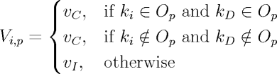
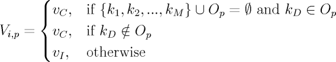
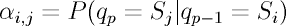
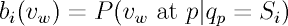
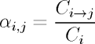
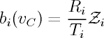
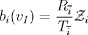

# Ancester inference of inbred populations with missing founder sequences ##

A method for inferring ancestral haplotypes that allows for genotype data to be absent for zero, one, or more ancestors

- [Overview](#overview)
- [Usage](#usage)
- [Model](#model)

## Overview ##


## Usage ##

#### *Input file* ####

The ancestor inference program takes as input a single BED format file containing chromosomal locations of homozygous
single-nucleotide polymorphisms (SNPs) in each genotyped ancestor strain as well as SNPs in the descendant strain. SNPs 
shared by multiple ancestors and/or the descendant are separated with an underscore in the fourth column of the BED file.
For example, if the strain ISS is descended from strains A, AKR, and DBA2, and segment of the input BED file might look 
like:

```
chr1	3001278	3001279	A_AKR
chr1	3001770	3001771	A_AKR
chr1	3007280	3007281	ILS_DBA2
chr1	3007334	3007335	AKR
chr1	3007757	3007758	ISS_DBA2
chr1	3007852	3007853	ISS_DBA2
chr1	3007889	3007890	ISS_DBA2
chr1	3008068	3008069	ISS
chr1	3008143	3008144	A_AKR
```

In addition, the program needs to know which strain is the descedant strain. In the above example, this would be ISS.

#### *Command line usage* ####

```
usage: ancestor_inference.py [-h] -i INPUT_FILE -d DESC_STRAIN [-o OUTPUT_DIR]
                             [-t TRANS_IN_P] [-e EMIT_SAME_P] [-m MAX_ITER]
                             [-c PROB_DIST_CUTOFF] [-p] [-r RECOMB_RATES_FILE]
                             [-a ADJUST_RECOMB] [-u USE_UNKNOWN]
                             [-k UNK_CUTOFF] [-ep EFFECTIVE_POP]
                             [-ng NUM_GENERATIONS] [-si SV_INSERTIONS_FILE]
                             [-sd SV_DELETIONS_FILE] [-gs GRID_SIZE] [-ad]
                             [-ap] [-w] [-v]

arguments:
  -h, --help            show this help message and exit
  -i INPUT_FILE, --input-file INPUT_FILE
                        Input SNP data file (BED file format) (default: None)
  -d DESC_STRAIN, --desc-strain DESC_STRAIN
                        Name of descendant in input SNP file (default: None)
  -o OUTPUT_DIR, --output-dir OUTPUT_DIR
                        Directory for output files (if not specified, output
                        directory will default to the same directory as the
                        input file) (default: None)
  -t TRANS_IN_P, --trans-in-p TRANS_IN_P
                        Starting trans-in probability (can be a value or range
                        of values in the form "[x-y]", which is divided into
                        parts with the -gs flag) (default: 0.64)
  -e EMIT_SAME_P, --emit-same-p EMIT_SAME_P
                        Starting emit-same probability (can be a value or
                        range of values in the form "[x-y]", which is divided
                        into parts with the -gs flag) (default: 0.99)
  -m MAX_ITER, --max-iter MAX_ITER
                        Maximum number of EM iterations (default: 50)
  -c PROB_DIST_CUTOFF, --prob-dist-cutoff PROB_DIST_CUTOFF
                        Probability distance cutoff to end EM loop (default:
                        0.001)
  -p, --parallel        Run viterbi algorithm over each chromosome in parallel
                        (default: False)
  -r RECOMB_RATES_FILE, --recomb-rates-file RECOMB_RATES_FILE
                        Input file with recombination rates to be used as
                        priors for transition probabilities (default: None)
  -a ADJUST_RECOMB, --adjust-recomb ADJUST_RECOMB
                        Multiplier to adjust expected number of recombinations
                        (can be a value or range of values in the form
                        "[x-y]", which is divided into parts with the -gs
                        flag) (default: 1.0)
  -u USE_UNKNOWN, --use-unknown USE_UNKNOWN
                        Set to true to capture ungenotyped ancestors in an
                        Unknown state (default: False)
  -k UNK_CUTOFF, --unk-cutoff UNK_CUTOFF
                        Cutoff for fraction of Unk SNPs required for an
                        ancestor block to be relabeled as Unk (can be a value
                        or range of values in the form "[x-y]", which is
                        divided into parts with the -gs flag) (default: 1.0)
  -ep EFFECTIVE_POP, --effective-pop EFFECTIVE_POP
                        Effective population (N_e) used in recombination rate
                        calculations (default: 1)
  -ng NUM_GENERATIONS, --num-generations NUM_GENERATIONS
                        Estimated number of generations between ancestors and
                        descendant used in recombation rate calculations
                        (default: 1)
  -si SV_INSERTIONS_FILE, --sv-insertions-file SV_INSERTIONS_FILE
                        Input file for insertion structural variants used to
                        score HMM results (default: None)
  -sd SV_DELETIONS_FILE, --sv-deletions-file SV_DELETIONS_FILE
                        Input file for deletion structural variants used to
                        score HMM results (default: None)
  -gs GRID_SIZE, --grid-size GRID_SIZE
                        Number of items to divide a range of input values into
                        (default: 2)
  -ad, --append-date    Append date to output filename (default: False)
  -ap, --append-params  Append string to output filename based on the input
                        parameters (default: False)
  -w, --write-iter      Calculate scores and write to output file at each
                        iteration within the EM loop (default: False)
  -v, --verbose         Verbose (default: False)
```

## Model ##


#### _Overview_ ####

In multi-parental populations, descendant strains inherit distinct haplotype blocks from each ancestor strain. The
haploblocks, therefore, contain identifying genotypic markers present in the originating ancestor, with slight
modification due to \textit{de novo} mutations. Intuitively we can say that segments of the descendant's genome with
consistent single-nucleotide polymorphisms (SNPs) primarily from a single ancestor were likely inherited from that
ancestor and boundaries between haploblocks represent historical recombination events (Figure 1a).
To probabilistically infer the most likely boundaries and ancestral origin of every such segment in a descendant's
genome, we developed the hidden Markov model (HMM) defined here. For our HMM training set, we use all SNP positions in
the descendant genome and every ancestor genome where SNP data is available. Segments likely to have come from an
unsequenced ancestor (for which there is no SNP data) are classified as ''Unknown''. As such, our fully-connected HMM
consists of a state for each genotyped ancestor and an Unknown state if the descendant was derived from additional
unsequenced ancestors (Figure 1b).

>
>**Figure 1: a)** The ancestor assignments of haploblocks are based on the consistency with which the descendant strain 
>shares SNPs with ancestor strains in a particular region. In the cartoon example shown, _A<sub>1</sub>_, _A<sub>2</sub>_, 
>and _A<sub>3</sub>_ ancestor SNPs are colored if they share the SNP location with a _Desc_ SNP and are black if they do not. 
>The inferred origin of region is output by our model, where gaps between inferred haploblocks (black arrows) indicate 
>regions where a recombination event took place during breeding. **b)** State diagram of the hidden Markov model used to infer 
>ancestry. Each state _A<sub>1</sub>, A<sub>2</sub>, ..., A<sub>N</sub>_ represents a sequenced ancestor and the _Unk_ state 
>captures any unsequenced ancestor strains. All possible transitions from state _A<sub>1</sub>_ are highlighted. Transitions 
>between distinct states correspond to recombination events during breeding, while transitions to the same state indicate 
>adjacent SNPs belong to the same ancestral haploblock.

As input, the model takes homozygous SNP data from each ancestor and the descendant strain in the form of BED format
files. Each SNP position corresponds to a single observation in the HMM. Initial emission rates are based on if the
ancestor SNPs at a given position are consistent with the descendant SNP. For example, if a given position on the genome
contains a SNP from ancestor _S<sub>1</sub>_ and a SNP from the descendant, state _S<sub>1</sub>_ is given a high emission rate for that
position. If a given position contains a SNP from the descendant, but not from ancestor _S<sub>1</sub>_, state _S<sub>1</sub>_ is given a
low emission rate for that position. Lastly, if a given position contains a SNP from ancestor _S<sub>1</sub>_, but not from the
descendant, state _S<sub>1</sub>_ is given a low emission rate for that position. We note that inconsistencies can arise from
sequencing errors and \textit{de novo} mutations, so ancestor states still have emission rates greater than 0.0 at
positions where the ancestor SNP data is inconsistent with the descendant SNP data. Transitions between distinct states
correspond to recombination events during breeding, while transitions to the same state indicate adjacent SNPs belong to
the same ancestral haploblock. As adjacent SNPs are likely to be from the same inherited region, we set the initial
transition probability of transitioning from one state to the same state as high and the transition probability of
transitioning from one state to a different state as low.

#### _Formal description_ ####

More formally, we define our HMM as follows: we denote each position in the genome where any ancestor or the descendant 
strain contains a SNP as _p = 1, 2, ..._ and the state at position _p_ as _q<sub>p</sub>_. _q<sub>p</sub> &#8712; S_ where 
_S = {S<sub>1</sub>, S<sub>2</sub>, ..., S<sub>N</sub>}_ and _S<sub>1</sub>, S<sub>2</sub>, ..., S<sub>N</sub>_ are states 
representing the ancestor from which position _p_ in the descendant genome originated. Note that one of the states in _S_ 
can be the "Unknown" state (_S<sub>U</sub>_) which represents a position in the descendant genome originating from an 
ancestor for which we have no genotype information.

At a given position _p_, we observe SNPs in one or more of the ancestors and/or in the descendant. We denote the possible 
SNPs as _K = {k<sub>1</sub>, k<sub>2</sub>, ..., k<sub>M</sub>, k<sub>D</sub>}_, where _k<sub>D</sub>_ corresponds to a 
SNP in the descendant genome and _k<sub>1</sub>, k<sub>2</sub>, ..., k<sub>M</sub>_ correspond to a SNP in the ancestor 
genomes. Notably, _k<sub>1</sub>, k<sub>2</sub>, ..., k<sub>M</sub>_ all have corresponding states in _S_, but _S_ can 
contain the Unknown state, _S<sub>U</sub>_, which is not represented in _K_. The set of SNPs observed at position _p_ is 
_O<sub>p</sub>_ where _O<sub>p</sub> &#8838; K_.

Each state has two observation symbols, _V = {v<sub>C</sub>, v<sub>I</sub>}_, corresponding to whether the descendant SNP 
data is consistent (_v<sub>C</sub>_) or inconsistent (_v<sub>I</sub>_) with the state SNP data at a given position. For a 
known ancestor state _S<sub>i</sub> &#8800; S<sub>U</sub>_, _V<sub>i</sub>_ at position _p_ is defined as:

<p align="center">
  
</p>

For the Unknown state _S<sub>U</sub>_, a SNP in the descendant genome is considered consistent with the Unknown state 
_S<sub>U</sub>_ only if none of the known ancestors contain a SNP at that position as well. We note that this creates a 
bias towards under calling the Unknown state, which is addressed via an input parameter to the model. For the Unknown 
ancestor state _S<sub>i</sub> = S<sub>U</sub>_, _V<sub>i</sub>_ at position _p_ is defined as:

<p align="center">
  
</p>

The state transition probability distribution is denoted as _A = {&#945;<sub>i,j</sub>}_ where:

<p align="center">
  
</p>

The observation symbol probability distribution in state _i_ is denoted as 
_B = {b<sub>i</sub>(v<sub>w</sub> &#8712; {v<sub>C</sub>, v<sub>I</sub>})}_ where:

<p align="center">
  
</p>

Each state is given an equal initial probability.

To further inform the model, we allow for a genetic map to be input as a prior for the transition probabilities. We 
converge on optimal transition and emission probabilities by running the HMM through an Expectation-Maximization (EM) loop. 
In each iteration, the maximum-likelihood path (MLP) through the HMM is found using the Viterbi algorithm (maximization 
step), then transition and emission probabilities are recalculated based on the results (expectation step). The first MLP 
is found using initial transition and emission probabilities passed in by the user. In every subsequent iteration, transition 
probabilities are recalculated with:

<p align="center">
  
</p>

Where _C<sub>{i &#8594; j}</sub>_ is the number of times _S<sub>j</sub>_ is classified in a SNP position following a 
SNP position classified as _S<sub>i</sub>_, and _C<sub>i</sub>_ is the total number of times _S<sub>i</sub>_ is classified 
(ie. the number of times _S<sub>i</sub>_ is followed by any state, including itself).

Emission probabilities are recalculated as follows:

<p align="center">
  
</p>
<p align="center">
  
</p>

Where _R<sub>i</sub>_ is the total number of times that _S<sub>i</sub>_ is classified at locations where 
_V<sub>i,p</sub>(S<sub>i</sub>)_ equals _v<sub>C</sub>_ and _T<sub>i</sub>_ is the total number of times 
_V<sub>i,p</sub>(S<sub>i</sub>)_ equals _v<sub>C</sub>_. _R<sub>i&#773;</sub>_ is the total number of times that _S<sub>i</sub>_ 
is classified at locations where _V<sub>i,p</sub>(S<sub>i</sub>)_ _does not_ equal _v<sub>C</sub>_ and _T<sub>i&#773;</sub>_ 
is the total number of times _V<sub>i,p</sub>(S<sub>i</sub>)_ _does not_ equal _v<sub>C</sub>_. The two fractions are then 
normalized to 1.0 (_Z<sub>i</sub>_).


#### _Additional details_ ####

Additionally, we identify regions within the descendant genome that are identical by descent (IBD). Sometimes large segments 
of the ancestor genomes are identical and indistinguishable from one another. We sought to identify these regions within 
the HMM output, where a particular ancestor is chosen (by Viterbi) based on little to no informative positions. In these 
cases, there is no way to truly distinguish the ancestor of origin so we reclassify the segment as IBD.

Haplotypes in the descendant strain inherited from an ungenotyped ancestor may contain informative markers shared by other 
ancestor strains. In these cases, the markers shows evidence for the region having originated from the shared ancestor 
strains rather than the ungenotyped ancestor. In fact, informative markers from the ungenotyped ancestor will only show in 
the data when there is a SNP in the descendant strain that is not shared by any of the sequenced ancestors. This creates a 
natural bias towards labeling regions as being inherited from the sequenced ancestors rather than from the unsequenced 
ancestors. To adjust for this bias, we include an input parameter to give more weight towards classifying a region as the 
Unknown state when there are informative markers in the descendant that don't belong to any of the genotyped ancestors.

After classifying each SNP as having been inherited from a particular ancestor, adjacent SNPs inherited from the same 
ancestor are considered to belong to the same ancestral haploblock in the descendant genome. To assess the accuracy of 
the model's output, we include the ability to compare small insertion and deletion structural variants (indels) called 
in the descendant and ancestor strains against haploblocks classified by the HMM. Each descendant indel is labeled as 
either a “hit” or a “miss” based on whether an ancestor indel overlapping the descendant indel is consistent or inconsistent 
with the HMM-classified haploblock over that region. That is, for each haploblock classified by the model, we find all 
indels in the descendant strain and the ancestor strains that overlap that haploblock region. Then for each unique indel 
region, we check for consistency between the model classification and the ancestor indels if a descendant indel is also 
present. We score a “hit” if the indel region contains the indel of the ancestor classified from the HMM and a “miss” if 
the region does not contain that indel. The final ratio of hits to misses gives the HMM output a score.

